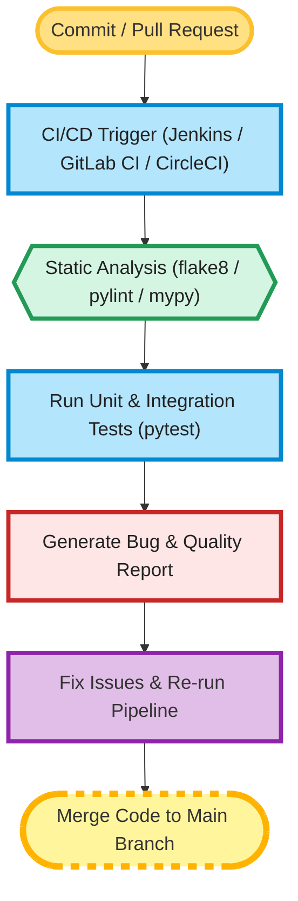

# Python CI Checks – Bugs Analysis

*(For Attendance & Notification Microservices)*

## Author Information

| Created by | Created on | Version | Last Updated On | Pre Reviewer | L0 Reviewer | L1 Reviewer | L2 Reviewer |
| ---------- | ---------- | ------- | --------------- | ------------ | ----------- | ----------- | ----------- |
| Sonal      | 11-08-2025 | V 1.0   | 11-08-2025      | Anjali       |             |             |             |

---

## Table of Contents

* [Introduction](#introduction)
* [What is Python CI Bugs Analysis?](#what-is-python-ci-bugs-analysis)
* [Why is Bugs Analysis Important in Python CI?](#why-is-bugs-analysis-important-in-python-ci)
* [Workflow of CI Bugs Analysis](#workflow-of-ci-bugs-analysis)
* [Different Tools for Python Bugs Analysis](#different-tools-for-python-bugs-analysis)
* [Comparison of Popular Tools](#comparison-of-popular-tools)
* [Advantages of Python CI Bugs Analysis](#advantages-of-python-ci-bugs-analysis)
* [Best Practices](#best-practices)
* [Recommendations & Conclusion](#recommendations--conclusion)
* [Contact Information](#contact-information)
* [References](#references)

---

## Introduction

This document describes the **Python CI Checks for Bugs Analysis** process applied to the **Attendance API** and **Notification Worker** microservices.
The goal is to ensure **code quality, maintainability, and early bug detection** by integrating static analysis, testing, and quality gates into the CI/CD pipeline.

---

## What is Python CI Bugs Analysis?

**Bugs analysis** in Python CI involves **automatically scanning and testing code** to detect syntax errors, logical flaws, and potential runtime issues before merging changes.
For both **attendance-api** and **notification-worker**, this includes:

* **Static code analysis** for linting & style compliance.
* **Unit & integration testing** for functional verification.
* **Code quality metrics** for maintainability and complexity.
* **Security checks** to catch unsafe patterns.

---

## Why is Bugs Analysis Important in Python CI?

| Reason                      | Description                                                            |
| --------------------------- | ---------------------------------------------------------------------- |
| **Early Issue Detection**   | Avoids production failures by catching bugs early.                     |
| **Code Quality**            | Maintains readability, maintainability, and structure.                 |
| **Security**                | Flags unsafe coding patterns or vulnerable dependencies.               |
| **Microservices Stability** | Ensures both attendance & notification services run reliably together. |
| **Faster Development**      | Reduces manual review time and rework.                                 |

---

---

## Workflow of CI Bugs Analysis

| Step | Action                                                                                   |
| ---- | ---------------------------------------------------------------------------------------- |
| 1    | Developer pushes changes to `attendance-api` or `notification-worker` repository.        |
| 2    | CI pipeline (e.g., Jenkins, GitLab CI/CD, CircleCI) is automatically triggered.          |
| 3    | Static analysis tools (flake8, pylint, mypy) run to detect style issues and code errors. |
| 4    | Unit and integration tests execute using `pytest` or equivalent test frameworks.         |
| 5    | Code coverage and quality metrics are calculated and stored for reporting.               |
| 6    | Bug reports, warnings, and test results are displayed in CI logs or dashboards.          |
| 7    | Developer resolves issues and re-runs the pipeline until all checks pass successfully.   |

---

**Workflow Diagram:**

---

## Different Tools for Python Bugs Analysis

| Tool Name       | Purpose                                          | Highlights                                |
| --------------- | ------------------------------------------------ | ----------------------------------------- |
| **flake8**      | Style guide enforcement and error detection      | Lightweight, PEP8 compliant               |
| **pylint**      | Detects coding standard violations & code smells | Configurable, detailed scoring system     |
| **mypy**        | Static type checking                             | Prevents type-related runtime errors      |
| **pytest**      | Testing framework                                | Supports unit, functional, and API tests  |
| **coverage.py** | Measures code coverage of tests                  | Reports lines missed by tests             |
| **bandit**      | Security-focused static analysis                 | Detects common security issues            |
| **SonarQube**   | Comprehensive quality & bug analysis             | Quality gates, dashboards, multi-language |

---

## Comparison of Popular Tools

| Feature/Tool       | flake8 | pylint | mypy   | pytest | bandit | SonarQube   |
| ------------------ | ------ | ------ | ------ | ------ | ------ | ----------- |
| **Bug Detection**  | Medium | High   | Medium | Medium | Low    | High        |
| **Security Focus** | Low    | Low    | No     | No     | High   | Medium      |
| **Type Checking**  | No     | No     | Yes    | No     | No     | No          |
| **Speed**          | Fast   | Medium | Medium | Fast   | Fast   | Medium      |
| **Setup**          | Easy   | Easy   | Easy   | Easy   | Easy   | Medium      |
| **Cost**           | Free   | Free   | Free   | Free   | Free   | Paid & Free |

---

## Advantages of Python CI Bugs Analysis

| Advantage                  | Benefit                                           |
| -------------------------- | ------------------------------------------------- |
| **Consistency**            | Both microservices follow the same quality rules. |
| **Early Bug Detection**    | Fixes issues before deployment.                   |
| **Improved Security**      | Prevents vulnerable code from being merged.       |
| **High Maintainability**   | Ensures clean, understandable code.               |
| **Confidence in Releases** | Reduces fear of introducing regressions.          |

---

## Best Practices

* Enforce **flake8 & pylint** rules for consistent coding style.
* Require **pytest coverage ≥ 80%** before merging.
* Run **mypy** to avoid type-related bugs.
* Include **bandit** for security checks in all Python services.
* Integrate with **SonarQube** for quality gates across all microservices.
* Automate notifications to Slack/Teams when CI fails.
* Maintain separate configs (`.flake8`, `.pylintrc`, `mypy.ini`) for flexibility.

---

## Recommendations & Conclusion

For both **attendance-api** and **notification-worker**:

* Use **flake8, pylint, mypy, pytest, bandit** in every CI run.
* Add **coverage.py** reports to enforce testing discipline.
* Integrate **SonarQube** for enterprise-level bug tracking.
* Block merges when **critical bugs or coverage failures** are found.

With this approach, both microservices will maintain **consistent quality standards**, reduce bugs, and improve reliability.

---

## Contact Information

| Name  | Email                                                                         |
| ----- | ----------------------------------------------------------------------------- |
| Sonal | [sonal.roha.snaatak@mygurukulam.co](mailto:sonal.roha.snaatak@mygurukulam.co) |

---

## References

| Link                                                             | Description                     |
| ---------------------------------------------------------------- | ------------------------------- |
| [flake8 Docs](https://flake8.pycqa.org/en/latest/)               | Python style and error checking |
| [pylint Docs](https://pylint.pycqa.org/en/latest/)               | Static code analysis            |
| [mypy Docs](https://mypy.readthedocs.io/en/stable/)              | Static type checker for Python  |
| [pytest Docs](https://docs.pytest.org/en/stable/)                | Python testing framework        |
| [bandit Docs](https://bandit.readthedocs.io/en/latest/)          | Security linter for Python      |
| [SonarQube Docs](https://docs.sonarsource.com/sonarqube/latest/) | Code quality and bug analysis   |

Do you want me to prepare that diagram next?
