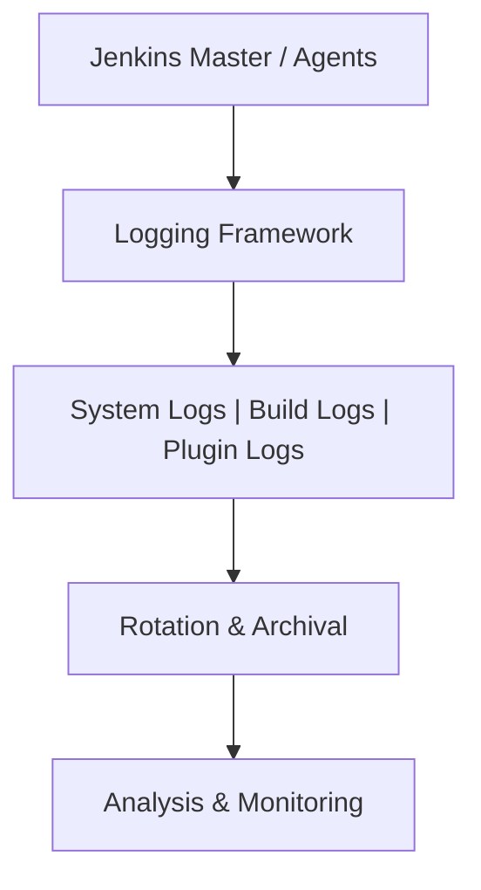

# Jenkins Documentation – Log Files

## Author Information

| Created by | Created on | Version | Last Updated On | Pre Reviewer | L0 Reviewer | L1 Reviewer | L2 Reviewer |
| ---------- | ---------- | ------- | --------------- | ------------ | ----------- | ----------- | ----------- |
| Sonal      | 11-08-2025 | V 1.0   | 11-08-2025      | Anjali       |             |             |             |

---

## Table of Contents

* [Introduction](#introduction)
* [What are Jenkins Log Files?](#what-are-jenkins-log-files)
* [Why are Jenkins Logs Important?](#why-are-jenkins-logs-important)
* [Workflow of Jenkins Log Generation](#workflow-of-jenkins-log-generation)
* [Different Types of Jenkins Log Files](#different-types-of-jenkins-log-files)
* [Advantages of Analyzing Jenkins Logs](#advantages-of-analyzing-jenkins-logs)
* [Best Practices](#best-practices)
* [Conclusion](#conclusion)
* [Contact Information](#contact-information)
* [References](#references)

---

## Introduction

Jenkins, as a widely used CI/CD automation server, generates **log files** that record job execution details, system events, plugin activities, and error messages.
These logs are essential for **troubleshooting, auditing, and performance monitoring** in Jenkins environments.

---

## What are Jenkins Log Files?

**Jenkins log files** are automatically generated records stored by Jenkins to keep track of system operations and pipeline executions.
They can be **system-level logs** for the Jenkins master, **build logs** for each job, or **plugin-specific logs**.

---

## Why are Jenkins Logs Important?

| Reason                   | Description                                                         |
| ------------------------ | ------------------------------------------------------------------- |
| **Troubleshooting**      | Identifies build failures, configuration errors, and plugin issues. |
| **Audit & Compliance**   | Maintains records of job triggers, changes, and user activities.    |
| **Performance Tracking** | Detects slow jobs, queue delays, and executor bottlenecks.          |
| **Security Monitoring**  | Captures unauthorized access attempts or suspicious job executions. |
| **Operational Insights** | Helps with capacity planning and Jenkins optimization.              |

---

## Workflow of Jenkins Log Generation

| Step | Action                                                                   |
| ---- | ------------------------------------------------------------------------ |
| 1    | Jenkins starts and initializes logging configuration.                    |
| 2    | System events and startup messages are written to `jenkins.log`.         |
| 3    | Each job execution generates a dedicated **console output log**.         |
| 4    | Plugin activities are logged in their respective log files (if enabled). |
| 5    | Logs are stored locally, rotated periodically, and optionally archived.  |
| 6    | Administrators review logs for troubleshooting, auditing, or monitoring. |

---

## **Workflow Diagram:**

---

## Different Types of Jenkins Log Files

| Log File Type   | Purpose                                                  | Location                                |
| --------------- | -------------------------------------------------------- | --------------------------------------- |
| **System Log**  | General Jenkins server events, startup/shutdown, errors. | `$JENKINS_HOME/jenkins.log`             |
| **Build Log**   | Console output for each job or pipeline execution.       | `$JENKINS_HOME/jobs/<job_name>/builds/` |
| **Access Log**  | HTTP request/response tracking (optional).               | Configurable via web server or plugin.  |
| **Plugin Logs** | Logs specific to plugins like Git, SonarQube, etc.       | `$JENKINS_HOME/logs/`                   |
| **Agent Logs**  | Logs from Jenkins build agents/slaves.                   | On respective agent machines.           |

---

## Advantages of Analyzing Jenkins Logs

| Advantage                  | Benefit                                                      |
| -------------------------- | ------------------------------------------------------------ |
| **Quick Issue Resolution** | Pinpoint causes of build and deployment failures.            |
| **Security Auditing**      | Track unauthorized activities or policy violations.          |
| **Performance Tuning**     | Optimize Jenkins pipelines based on execution time insights. |
| **Trend Analysis**         | Identify recurring build errors or flaky tests.              |
| **Compliance**             | Maintain historical logs for regulatory requirements.        |

---

## Best Practices

* **Set appropriate log levels** (INFO for normal use, DEBUG only when needed).
* **Enable log rotation** to avoid disk space exhaustion.
* **Centralize log storage** using ELK Stack, Splunk, or similar tools.
* **Mask sensitive information** before sharing logs.
* **Monitor logs in real-time** for faster incident response.
* **Regularly back up logs** to ensure historical data retention.

---

## Conclusion

Jenkins log files are more than just records—they are **a critical diagnostic and monitoring tool**.
By following best practices for logging and analysis, organizations can **reduce downtime, improve performance, and maintain security compliance** in their CI/CD workflows.

---

## Contact Information

| Name  | Email                                                                         |
| ----- | ----------------------------------------------------------------------------- |
| Sonal | [sonal.roha.snaatak@mygurukulam.co](mailto:sonal.roha.snaatak@mygurukulam.co) |

---

## References

| Link                                                                                            | Description                        |
| ----------------------------------------------------------------------------------------------- | ---------------------------------- |
| [Jenkins Logging Documentation](https://www.jenkins.io/doc/book/system-administration/logging/) | Official Jenkins logging guide     |
| [Jenkins Pipeline Logging Tips](https://www.jenkins.io/doc/book/pipeline/troubleshooting/)      | Debugging and troubleshooting logs |
| [ELK Stack Overview](https://www.elastic.co/what-is/elk-stack)                                  | Centralized log analysis           |
| [Splunk Documentation](https://docs.splunk.com/)                                                | Enterprise log monitoring          |

