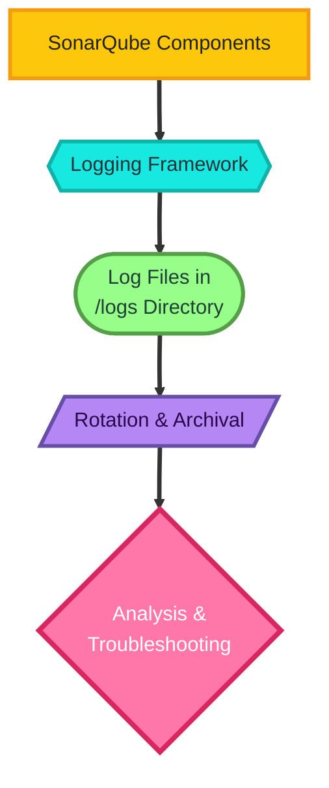

# SonarQube Documentation – Log Files

## Author Information

| Created by | Created on | Version | Last Updated On | Pre Reviewer | L0 Reviewer | L1 Reviewer | L2 Reviewer |
| ---------- | ---------- | ------- | --------------- | ------------ | ----------- | ----------- | ----------- |
| Sonal      | 11-08-2025 | V 1.0   | 11-08-2025      | Anjali       |             |             |             |

---

## Table of Contents

* [Introduction](#introduction)
* [What are SonarQube Log Files?](#what-are-sonarqube-log-files)
* [Why are SonarQube Logs Important?](#why-are-sonarqube-logs-important)
* [Workflow of Log Generation](#workflow-of-log-generation)
* [Types of SonarQube Log Files](#types-of-sonarqube-log-files)
* [Advantages of Analyzing Logs](#advantages-of-analyzing-logs)
* [Best Practices](#best-practices)
* [Conclusion](#conclusion)
* [Contact Information](#contact-information)
* [References](#references)

---

## Introduction

This document explains **SonarQube Log Files**—their purpose, structure, types, and how to interpret them.
It also covers the workflow of log generation, the advantages of analyzing logs, and best practices for maintaining them.

---

## What are SonarQube Log Files?

**SonarQube Log Files** are diagnostic files generated by SonarQube components (server, web interface, background tasks, and search engine) to record activities, errors, and performance data.
They are crucial for monitoring, troubleshooting, and optimizing the system.

---

## Why are SonarQube Logs Important?

| Reason                     | Description                                                                   |
| -------------------------- | ----------------------------------------------------------------------------- |
| **Troubleshooting**        | Helps in identifying and resolving errors or failures quickly.                |
| **Performance Monitoring** | Tracks execution times and resource usage to optimize SonarQube performance.  |
| **Audit Trail**            | Maintains a record of activities for compliance and internal audits.          |
| **System Health**          | Detects issues such as memory leaks, connection failures, or indexing errors. |
| **Upgrade & Migration**    | Ensures smooth transitions by analyzing old logs before and after changes.    |

---

## Workflow of Log Generation

| Step | Action                                                                  |
| ---- | ----------------------------------------------------------------------- |
| 1    | SonarQube components start and initialize logging frameworks.           |
| 2    | Each component writes events to its dedicated log file.                 |
| 3    | Log entries are timestamped, categorized (INFO, WARN, ERROR, DEBUG).    |
| 4    | Logs are stored in the `logs/` directory of the SonarQube installation. |
| 5    | Rotation and archival happen based on configuration.                    |
| 6    | Administrators analyze logs for maintenance, debugging, or compliance.  |

---

## **Workflow Diagram:**

---

---

## Types of SonarQube Log Files

| Log File       | Purpose                                                   | Location |
| -------------- | --------------------------------------------------------- | -------- |
| **sonar.log**  | General information about the SonarQube server lifecycle. | `/logs/` |
| **web.log**    | Logs related to the web server and user interface.        | `/logs/` |
| **ce.log**     | Background task execution logs (Compute Engine).          | `/logs/` |
| **es.log**     | Search engine (Elasticsearch) related logs.               | `/logs/` |
| **access.log** | HTTP request/response logs for auditing.                  | `/logs/` |

---

## Advantages of Analyzing Logs

| Advantage                   | Benefit                                                        |
| --------------------------- | -------------------------------------------------------------- |
| **Faster Issue Resolution** | Reduces downtime by pinpointing errors quickly.                |
| **Security Monitoring**     | Detects suspicious activities or unauthorized access attempts. |
| **Performance Tuning**      | Helps identify slow queries or bottlenecks.                    |
| **Capacity Planning**       | Tracks trends to predict scaling needs.                        |

---

## Best Practices

* Enable **appropriate log level** (INFO for normal ops, DEBUG only for troubleshooting).
* Use **log rotation** to prevent disk overuse.
* Regularly archive and back up logs for compliance.
* Integrate logs with **centralized monitoring tools** (e.g., ELK Stack, Splunk).
* Mask sensitive data before storing or sharing logs.
* Periodically review logs for anomalies even when no issue is reported.

---

## Conclusion

SonarQube logs are a **critical operational resource**. They serve as a window into system health, performance, and security.
Well-maintained logs not only assist in troubleshooting but also play a significant role in capacity planning, compliance, and long-term operational success.

---

## Contact Information

| Name  | Email                                                                         |
| ----- | ----------------------------------------------------------------------------- |
| Sonal | [sonal.roha.snaatak@mygurukulam.co](mailto:sonal.roha.snaatak@mygurukulam.co) |

---

## References

| Link                                                                               | Description                      |
| ---------------------------------------------------------------------------------- | -------------------------------- |
| [SonarQube Docs - Logs](https://docs.sonarsource.com/sonarqube/latest/setup/logs/) | Official SonarQube logging guide |
| [ELK Stack Overview](https://www.elastic.co/what-is/elk-stack)                     | Centralized logging solution     |
| [Splunk Documentation](https://docs.splunk.com/)                                   | Enterprise log analysis platform |

---

If you want, I can **also add a clean workflow diagram image** instead of the plain text diagram so it matches the style of the SSL doc’s image header. That would make it visually consistent.
Do you want me to create that image?
